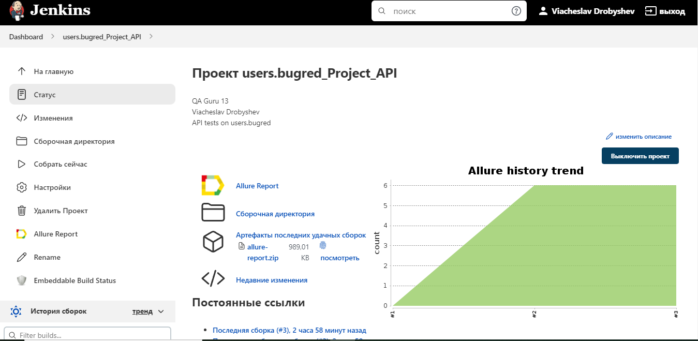
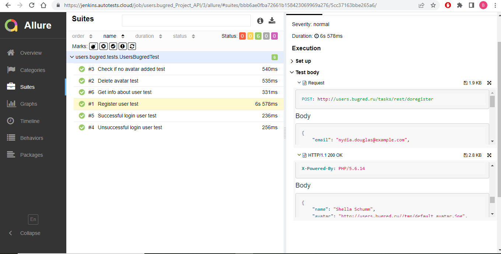
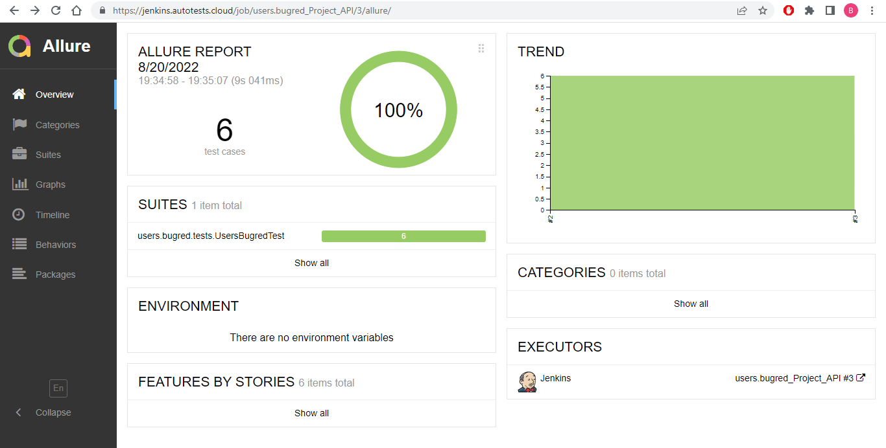

# Проект по автоматизации тестирования API
<a target="_blank" href="http://users.bugred.ru/">Веб сайт users.bugred.ru</a>

## ⤵️ Содержание:

> ➠[Реализованные проверки](#boom-Реализованные-проверки)
>
> ➠[Технологии](#classical_building-Технологии)
> 
> ➠[Сборка в Jenkins](#man_cook-Jenkins-job)
> 
> ➠[Allure отчет](#bar_chart-Allure-отчет)

## ⚜️ Реализованные проверки с исползованием моделей lombok и спецификаций

- ✓ Регистрация нового пользователя 
- ✓ Авторизация с существующим емейлом и паролем 
- ✓ Авторизация с несуществующим емейлом и паролем
- ✓ Проверка добавления аватарки пользователя
- ✓ Проверка удаления аватарки пользователя
- ✓ Проверка данных существующего пользователя

## 🤖 Технологии
<p align="center">


</p>

## 🎆 Jenkins job
</a>  <a target="_blank" href="https://jenkins.autotests.cloud/job/users.bugred_Project_API/">Jenkins job</a>
<p align="center">

</p>


###  Локальный запуск:
```
gradle clean test
```

## 📎 Allure-отчет
</a> Отчет в <a target="_blank" href="https://jenkins.autotests.cloud/job/users.bugred_Project_API/allure/#">Allure report</a>
<p align="center">


</p>
